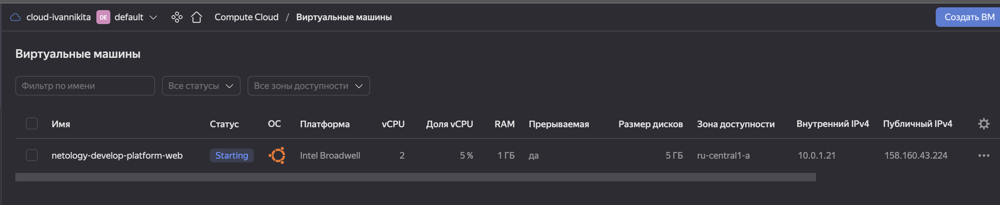
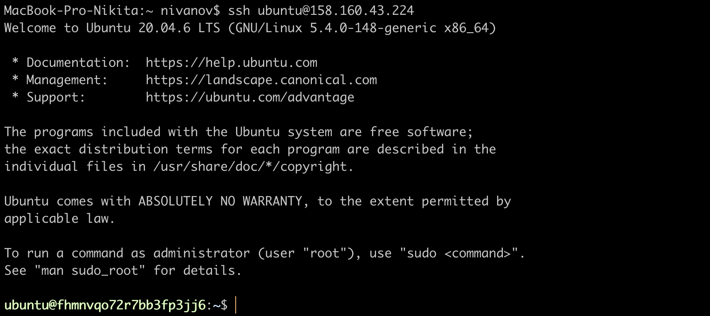
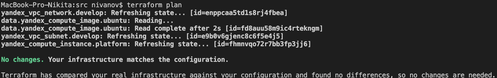
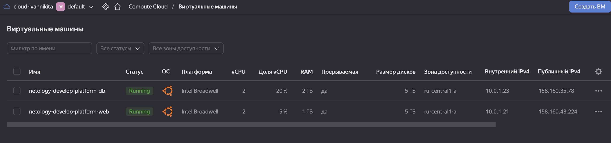
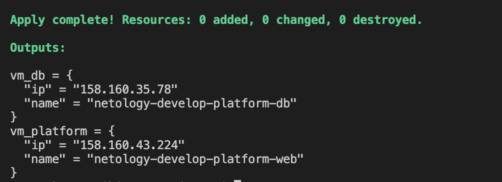
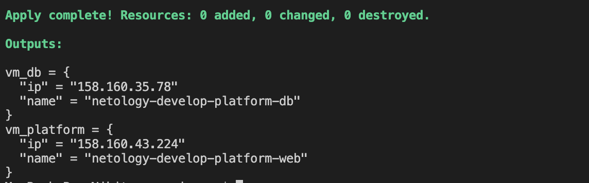
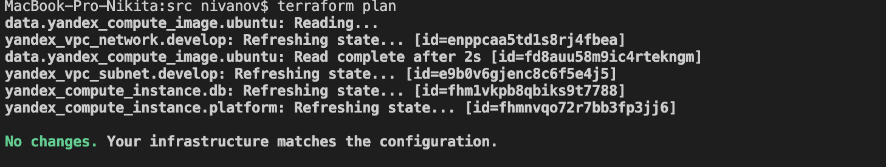

Задание 1
Изучите проект. В файле variables.tf объявлены переменные для yandex provider.
Переименуйте файл personal.auto.tfvars_example в personal.auto.tfvars. Заполните переменные (идентификаторы облака, токен доступа). Благодаря .gitignore этот файл не попадет в публичный репозиторий. Вы можете выбрать иной способ безопасно передать секретные данные в terraform.
Сгенерируйте или используйте свой текущий ssh ключ. Запишите его открытую часть в переменную vms_ssh_root_key.
Инициализируйте проект, выполните код. Исправьте возникшую ошибку. Ответьте в чем заключается ее суть?
Ответьте, как в процессе обучения могут пригодиться параметры preemptible = true и core_fraction=5 в параметрах ВМ? Ответ в документации Yandex cloud.
В качестве решения приложите:

скриншот ЛК Yandex Cloud с созданной ВМ
  

скриншот успешного подключения к консоли ВМ через ssh


ответы на вопросы:  
```preemptible указывает что эта вм не требует отказоустойчевости и может быть выключена в случае нехватки ресурсов```
```core_fraction Этот уровень определяет долю вычислительного времени физических ядер, которую гарантирует vCPU, в тестовой среде позволяет съэкономить на вычеслительных ресурсах```   
Задание 2  
Изучите файлы проекта.
Замените все "хардкод" значения для ресурсов yandex_compute_image и yandex_compute_instance на отдельные переменные. К названиям переменных ВМ добавьте в начало префикс vm_web_ . Пример: vm_web_name.
Объявите нужные переменные в файле variables.tf, обязательно указывайте тип переменной. Заполните их default прежними значениями из main.tf.
Проверьте terraform plan (изменений быть не должно).

Задание 3  
Создайте в корне проекта файл 'vms_platform.tf' . Перенесите в него все переменные первой ВМ.
Скопируйте блок ресурса и создайте с его помощью вторую ВМ(в файле main.tf): "netology-develop-platform-db" , cores = 2, memory = 2, core_fraction = 20. Объявите ее переменные с префиксом vm_db_ в том же файле('vms_platform.tf').
Примените изменения.  
  
Задание 4  
Объявите в файле outputs.tf отдельные output, для каждой из ВМ с ее внешним IP адресом.
Примените изменения.
В качестве решения приложите вывод значений ip-адресов команды terraform output  
  
Задание 5  
В файле locals.tf опишите в одном local-блоке имя каждой ВМ, используйте интерполяцию ${..} с несколькими переменными по примеру из лекции.
Замените переменные с именами ВМ из файла variables.tf на созданные вами local переменные.
Примените изменения.  
   
Задание 6   
Вместо использования 3-х переменных ".._cores",".._memory",".._core_fraction" в блоке resources {...}, объедените их в переменные типа map с именами "vm_web_resources" и "vm_db_resources".
Так же поступите с блоком metadata {serial-port-enable, ssh-keys}, эта переменная должна быть общая для всех ваших ВМ.
Найдите и удалите все более не используемые переменные проекта.
Проверьте terraform plan (изменений быть не должно).  
 