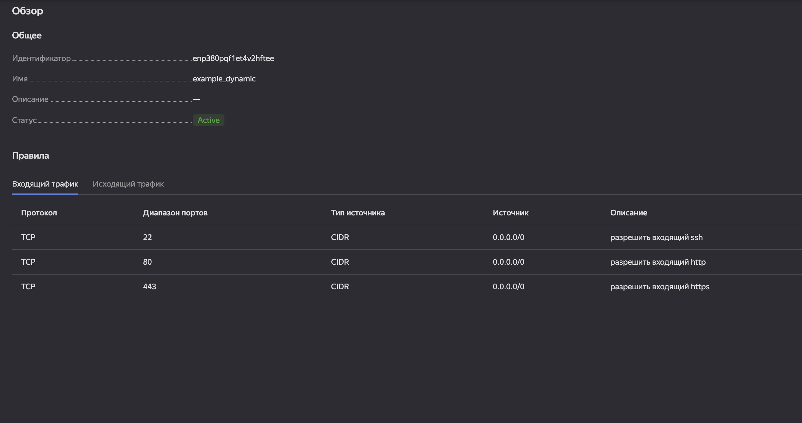
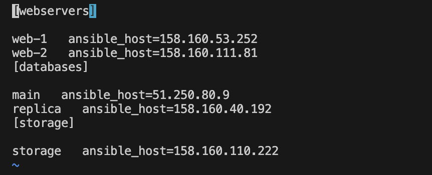

### Задание 1

1. Изучите проект.
2. Заполните файл personal.auto.tfvars
3. Инициализируйте проект, выполните код (он выполнится даже если доступа к preview нет).

Примечание: Если у вас не активирован preview доступ к функционалу "Группы безопасности" в Yandex Cloud - запросите доступ у поддержки облачного провайдера. Обычно его выдают в течении 24-х часов.

Приложите скриншот входящих правил "Группы безопасности" в ЛК Yandex Cloud  или скриншот отказа в предоставлении доступа к preview версии.
 

------

### Задание 2

1. Создайте файл count-vm.tf. Опишите в нем создание двух **одинаковых** виртуальных машин с минимальными параметрами, используя мета-аргумент **count loop**.
2. Создайте файл for_each-vm.tf. Опишите в нем создание 2 **разных** по cpu/ram/disk виртуальных машин, используя мета-аргумент **for_each loop**. Используйте переменную типа list(object({ vm_name=string, cpu=number, ram=number, disk=number  })). При желании внесите в переменную все возможные параметры.
3. ВМ из пункта 2.2 должны создаваться после создания ВМ из пункта 2.1.
4. Используйте функцию file в local переменной для считывания ключа ~/.ssh/id_rsa.pub и его последующего использования в блоке metadata, взятому из ДЗ №2.
5. Инициализируйте проект, выполните код.

------

### Задание 3

1. Создайте 3 одинаковых виртуальных диска, размером 1 Гб с помощью ресурса yandex_compute_disk и мета-аргумента count.
2. Создайте одну **любую** ВМ. Используйте блок **dynamic secondary_disk{..}** и мета-аргумент for_each для подключения созданных вами дополнительных дисков.
3. Назначьте ВМ созданную в 1-м задании группу безопасности.

------

### Задание 4

1. Создайте inventory-файл для ansible.
Используйте функцию tepmplatefile и файл-шаблон для создания ansible inventory-файла из лекции.
Готовый код возьмите из демонстрации к лекции [**demonstration2**](https://github.com/netology-code/ter-homeworks/tree/main/demonstration2).
Передайте в него в качестве переменных имена и внешние ip-адреса ВМ из задания 2.1 и 2.2.
2. Выполните код. Приложите скриншот получившегося файла.
 

Для общего зачета создайте в вашем GitHub репозитории новую ветку terraform-03. Закомитьте в эту ветку свой финальный код проекта, пришлите ссылку на коммит.   
**Удалите все созданные ресурсы**.

