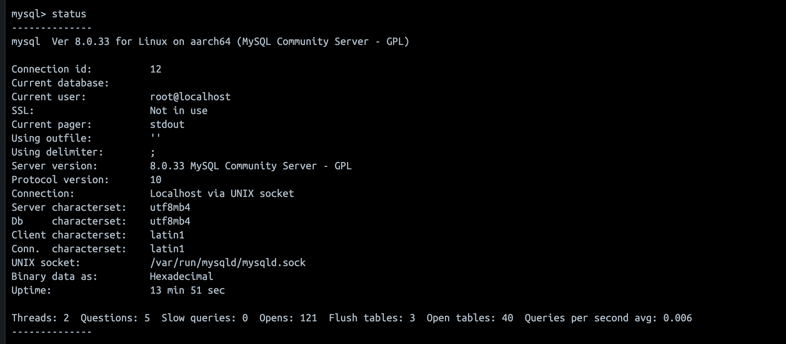

## 1. Используя Docker, поднимите инстанс PostgreSQL (версию 12) c 2 volume, в который будут складываться данные БД и бэкапы.
Приведите получившуюся команду или docker-compose-манифест.
```docker
docker run --name netology_postgres  -p 5432:5432 -e POSTGRES_PASSWORD=pgpwdnet -e PGDATA="/var/lib/postgresql/data/pgdata" -v /pgdata:/var/lib/postgresql/data -v /backup:/backup -d postgres:12
```
## Задача 1
Используя Docker, поднимите инстанс MySQL (версию 8). Данные БД сохраните в volume.

Изучите бэкап БД и восстановитесь из него.

Перейдите в управляющую консоль mysql внутри контейнера.

Используя команду \h, получите список управляющих команд.

Найдите команду для выдачи статуса БД и приведите в ответе из её вывода версию сервера БД.  


Подключитесь к восстановленной БД и получите список таблиц из этой БД.

Приведите в ответе количество записей с price > 300.

В следующих заданиях мы будем продолжать работу с этим контейнером.


## Задача 2
Создайте пользователя test в БД c паролем test-pass, используя:

плагин авторизации mysql_native_password
срок истечения пароля — 180 дней
количество попыток авторизации — 3
максимальное количество запросов в час — 100
аттрибуты пользователя:
Фамилия "Pretty"
Имя "James".
Предоставьте привелегии пользователю test на операции SELECT базы test_db.

Используя таблицу INFORMATION_SCHEMA.USER_ATTRIBUTES, получите данные по пользователю test и приведите в ответе к задаче.  

## Задача 3
Установите профилирование SET profiling = 1. Изучите вывод профилирования команд SHOW PROFILES;.

Исследуйте, какой engine используется в таблице БД test_db и приведите в ответе.

Измените engine и приведите время выполнения и запрос на изменения из профайлера в ответе:

на MyISAM,
на InnoDB.


## Задача 4
Изучите файл my.cnf в директории /etc/mysql.

Измените его согласно ТЗ (движок InnoDB):

скорость IO важнее сохранности данных;
нужна компрессия таблиц для экономии места на диске;
размер буффера с незакомиченными транзакциями 1 Мб;
буффер кеширования 30% от ОЗУ;
размер файла логов операций 100 Мб.
Приведите в ответе изменённый файл my.cnf.  
[my.cnf](files/my.cnf)