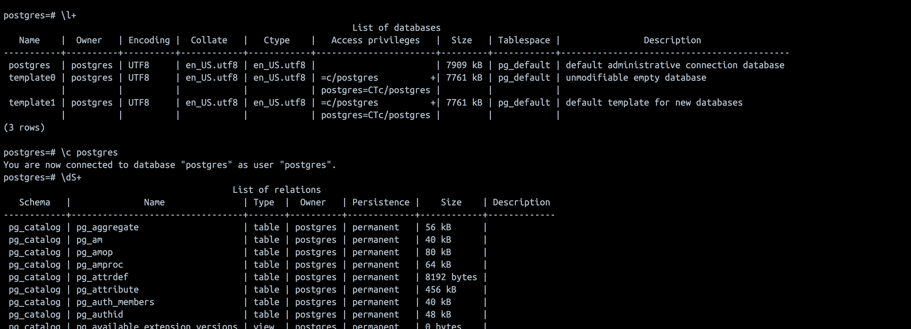
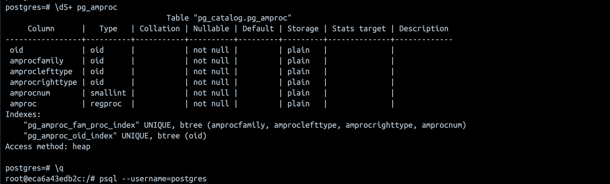
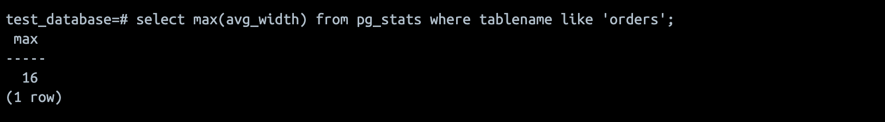
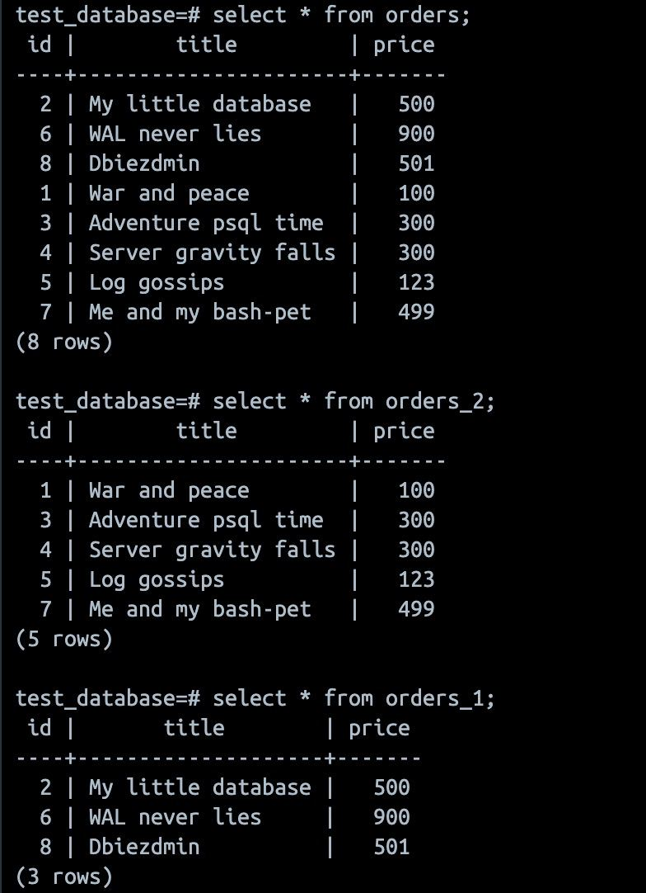

## Задача 1
Используя Docker, поднимите инстанс PostgreSQL (версию 13). Данные БД сохраните в volume.

Подключитесь к БД PostgreSQL, используя psql.

Воспользуйтесь командой \? для вывода подсказки по имеющимся в psql управляющим командам.

Найдите и приведите управляющие команды для:

вывода списка БД,
подключения к БД,
вывода списка таблиц,
вывода описания содержимого таблиц,
выхода из psql.


## Задача 2
Используя psql, создайте БД test_database.

Изучите бэкап БД.

Восстановите бэкап БД в test_database.

Перейдите в управляющую консоль psql внутри контейнера.

Подключитесь к восстановленной БД и проведите операцию ANALYZE для сбора статистики по таблице.

Используя таблицу pg_stats, найдите столбец таблицы orders с наибольшим средним значением размера элементов в байтах.

Приведите в ответе команду, которую вы использовали для вычисления, и полученный результат.

```
select max(avg_width) from pg_stats where tablename like 'orders';
```


## Задача 3
Архитектор и администратор БД выяснили, что ваша таблица orders разрослась до невиданных размеров и поиск по ней занимает долгое время. Вам как успешному выпускнику курсов DevOps в Нетологии предложили провести разбиение таблицы на 2: шардировать на orders_1 - price>499 и orders_2 - price<=499.

Предложите SQL-транзакцию для проведения этой операции.

Можно ли было изначально исключить ручное разбиение при проектировании таблицы orders?

```
создаем новую таблицу на основе существующей
CREATE TABLE orders_new
AS (SELECT * FROM orders WHERE 1=2);

переименовываем таблицы
ALTER TABLE orders RENAME TO orders_back;
ALTER TABLE orders_new RENAME TO orders;

создаем дочерние таблицы с правилами хранения (это надо было сделать на этапе проектирования)
CREATE TABLE orders_1 ( CHECK 	(price>499)) INHERITS (orders);
CREATE TABLE orders_2 ( CHECK (price<=499)) INHERITS (orders);

создаем правила по которым новые данные будут попадать в дочерние таблицы (это надо было сделать на этапе проектирования)
CREATE RULE ORDER_GT_499 AS ON INSERT TO orders WHERE (price>499) DO INSTEAD INSERT INTO orders_1 VALUES (NEW.*);

CREATE RULE ORDER_LE_499 AS ON INSERT TO orders WHERE (price<=499) DO INSTEAD INSERT INTO orders_2 VALUES (NEW.*);

переносим данные из старой таблицы в новую
INSERT INTO orders
  SELECT *
    FROM orders_back;

удаляем старую таблицу
DROP TABLE orders_back;
```

## Задача 4
Используя утилиту pg_dump, создайте бекап БД test_database. [Dump](files/postgres-backup.sql)

Как бы вы доработали бэкап-файл, чтобы добавить уникальность значения столбца title для таблиц test_database?
Добавить ключ UNIQUE

