## Задача 1

составьте Dockerfile-манифест для Elasticsearch,
соберите Docker-образ и сделайте push в ваш docker.io-репозиторий,
запустите контейнер из получившегося образа и выполните запрос пути / c хост-машины.
Требования к elasticsearch.yml:

данные path должны сохраняться в /var/lib,
имя ноды должно быть netology_test.
В ответе приведите:

текст Dockerfile-манифеста,
```
FROM --platform=linux/amd64 centos:7
LABEL maintainer="ivannikita@gmail.com"
ENV node_name test
ENV path_data /var/lib/elasticsearch
WORKDIR /tmp
RUN yum update -y && yum install java-1.8.0-openjdk.x86_64 -y && yum clean all && rm -rf /var/cache/yum
RUN mkdir /opt/elasticsearch && mkdir /var/lib/elasticsearch
RUN adduser elasticsearch
RUN curl https://mirrors.huaweicloud.com/elasticsearch/8.8.1/elasticsearch-8.8.1-linux-x86_64.tar.gz --output elasticsearch-8.8.1-linux-x86_64.tar.gz && tar -xzf elasticsearch-8.8.1-linux-x86_64.tar.gz  && mv elasticsearch-8.8.1/* /opt/elasticsearch/
COPY ./elasticsearch.yml /opt/elasticsearch/config/elasticsearch.yml
RUN chown -R elasticsearch:elasticsearch /opt/elasticsearch && chown -R elasticsearch:elasticsearch /var/lib/elasticsearch
RUN rm -rf /tmp/*
USER elasticsearch
ENTRYPOINT /opt/elasticsearch/bin/elasticsearch && bash
```
ссылку на образ в репозитории dockerhub
https://hub.docker.com/repository/docker/ivannikita/elastic_netology/general   
ответ Elasticsearch на запрос пути / в json-виде.
```
{
  "name" : "netology_test",
  "cluster_name" : "elasticsearch",
  "cluster_uuid" : "qK8CU9mHSxyFfgeJuolWQw",
  "version" : {
    "number" : "8.8.1",
    "build_flavor" : "default",
    "build_type" : "tar",
    "build_hash" : "f8edfccba429b6477927a7c1ce1bc6729521305e",
    "build_date" : "2023-06-05T21:32:25.188464208Z",
    "build_snapshot" : false,
    "lucene_version" : "9.6.0",
    "minimum_wire_compatibility_version" : "7.17.0",
    "minimum_index_compatibility_version" : "7.0.0"
  },
  "tagline" : "You Know, for Search"
}
```    

## Задача 2

Ознакомьтесь с документацией и добавьте в Elasticsearch 3 индекса в соответствии с таблицей:

Имя	Количество реплик	Количество шард
ind-1	0	1
ind-2	1	2
ind-3	2	4
Получите список индексов и их статусов, используя API, и приведите в ответе на задание.
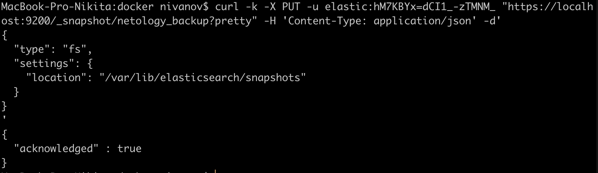

Получите состояние кластера Elasticsearch, используя API.
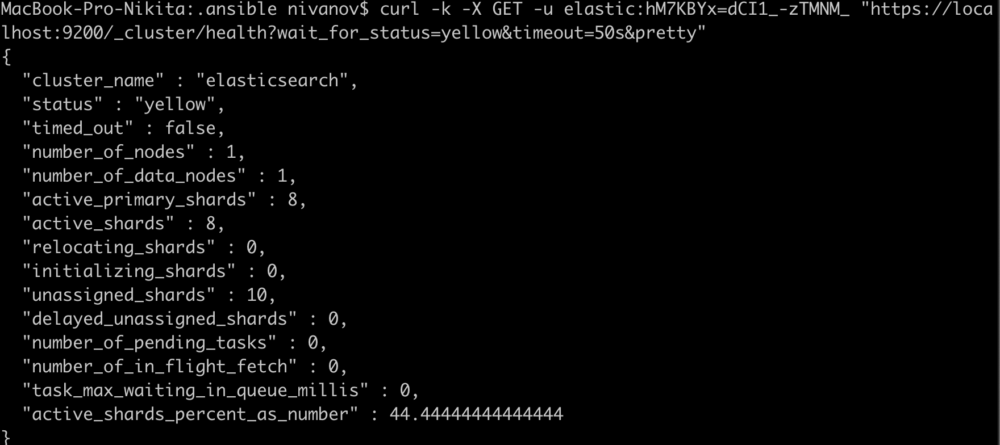

Как вы думаете, почему часть индексов и кластер находятся в состоянии yellow?
Желтый статус указывает на то что все шарды размещены на нодах, но не все реплики размещены. Это зависит от правильного назначения реплик.  
Удалите все индексы.
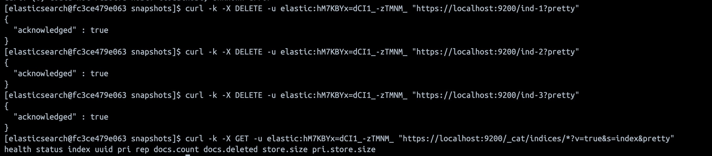

## Задача 3

Создайте директорию {путь до корневой директории с Elasticsearch в образе}/snapshots.
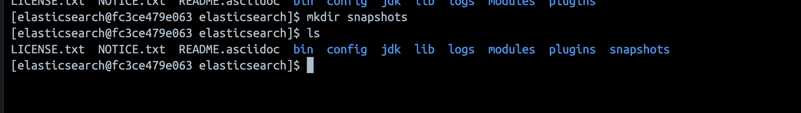
Используя API, зарегистрируйте эту директорию как snapshot repository c именем netology_backup.
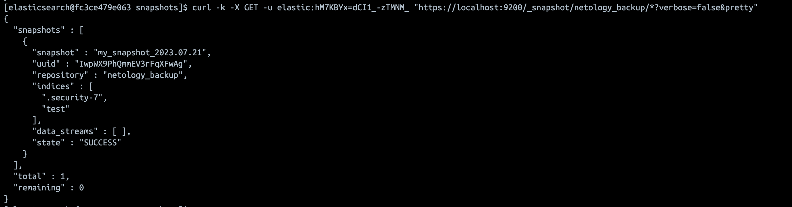

Приведите в ответе запрос API и результат вызова API для создания репозитория.
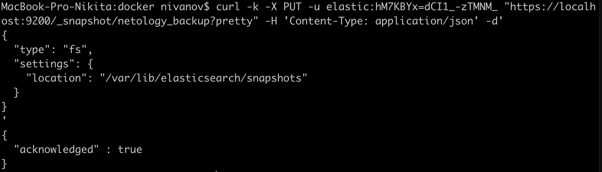
Создайте индекс test с 0 реплик и 1 шардом и приведите в ответе список индексов.
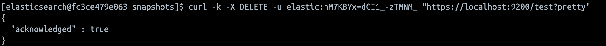
Создайте snapshot состояния кластера Elasticsearch.
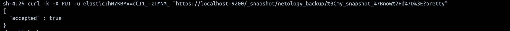
Приведите в ответе список файлов в директории со snapshot.
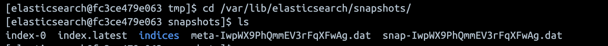
Удалите индекс test и создайте индекс test-2. Приведите в ответе список индексов.
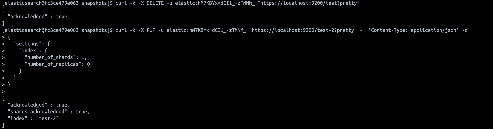
Восстановите состояние кластера Elasticsearch из snapshot, созданного ранее.
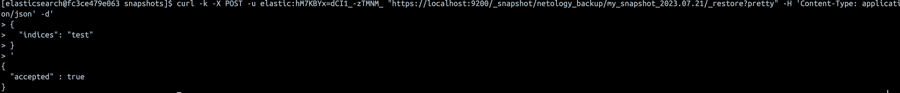
Приведите в ответе запрос к API восстановления и итоговый список индексов.
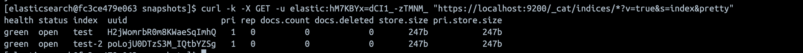