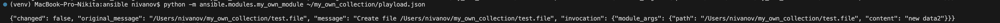
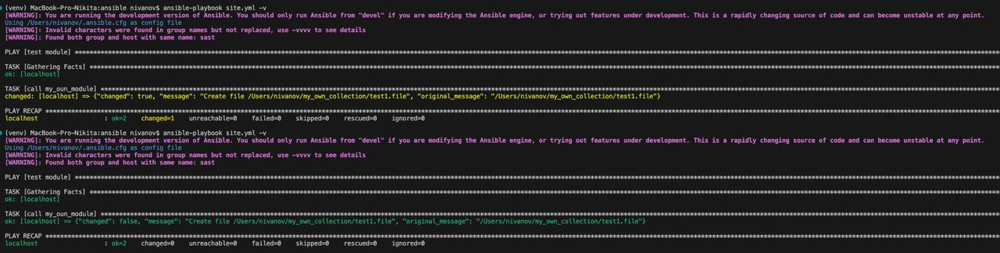
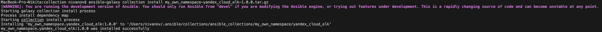
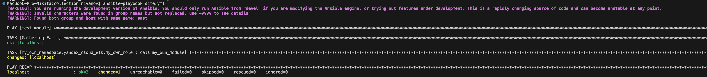

# Домашнее задание к занятию 6 «Создание собственных модулей»

## Основная часть

**Шаг 4.** Проверьте module на исполняемость локально.  
  
**Шаг 6.** Проверьте через playbook на идемпотентность.  

**Шаг 15.** Установите collection из локального архива: `ansible-galaxy collection install <archivename>.tar.gz`.  
  
**Шаг 16.** Запустите playbook, убедитесь, что он работает.  
   
**Шаг 17.** В ответ необходимо прислать ссылки на [collection](https://github.com/ivannikita/my_own_collection) и [tar.gz](./collection) архив.

