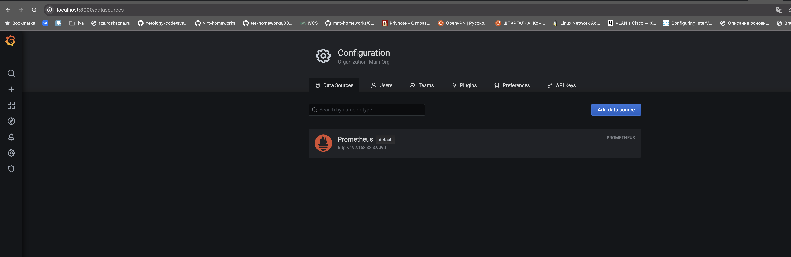
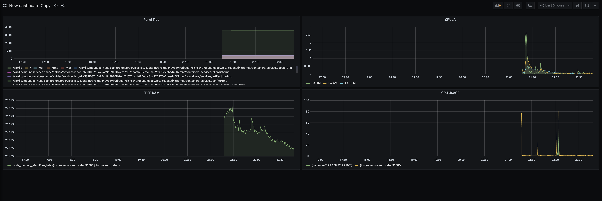
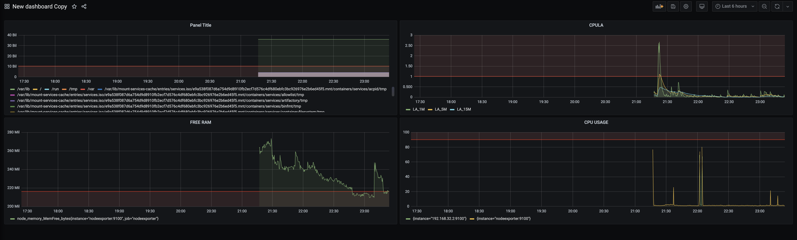

### Задание 1

1. Используя директорию [help](./help) внутри этого домашнего задания, запустите связку prometheus-grafana.
1. Зайдите в веб-интерфейс grafana, используя авторизационные данные, указанные в манифесте docker-compose.
1. Подключите поднятый вами prometheus, как источник данных.
1. Решение домашнего задания — скриншот веб-интерфейса grafana со списком подключенных Datasource.

## Задание 2

Создайте Dashboard и в ней создайте Panels:

- утилизация CPU для nodeexporter (в процентах, 100-idle);  
`100 - (avg by (instance) (rate(node_cpu_seconds_total{job="nodeexporter",mode="idle"}[1m])) * 100)`
- CPULA 1/5/15;   
`node_load1{instance="nodeexporter:9100",job="nodeexporter"}
node_load5{instance="nodeexporter:9100",job="nodeexporter"}
node_load15{instance="nodeexporter:9100",job="nodeexporter"}`
- количество свободной оперативной памяти;  
`node_memory_MemFree_bytes{instance="nodeexporter:9100",job="nodeexporter"}`
- количество места на файловой системе.  
` node_filesystem_avail_bytes{instance="nodeexporter:9100",job="nodeexporter"}`
Для решения этого задания приведите promql-запросы для выдачи этих метрик, а также скриншот получившейся Dashboard.

## Задание 3

1. Создайте для каждой Dashboard подходящее правило alert — можно обратиться к первой лекции в блоке «Мониторинг».
1. В качестве решения задания приведите скриншот вашей итоговой Dashboard.

## Задание 4

1. Сохраните ваш Dashboard.Для этого перейдите в настройки Dashboard, выберите в боковом меню «JSON MODEL». Далее скопируйте отображаемое json-содержимое в отдельный файл и сохраните его.
1. В качестве решения задания приведите листинг этого файла.

[Dashboard](./dashboard.json)