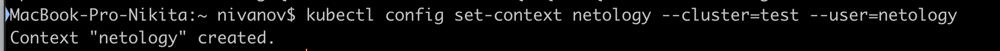

1. Создайте и подпишите SSL-сертификат для подключения к кластеру.


2. Настройте конфигурационный файл kubectl для подключения.

3. Создайте роли и все необходимые настройки для пользователя.
```yaml
apiVersion: rbac.authorization.k8s.io/v1
kind: Role
metadata:
  name: netology_2_4
rules:
- apiGroups: [""]
  resources: ["pods","pods/log"]
  verbs: ["get", "list"]
- apiGroups: [""]
  resources: [ "pods/describe"]
  verbs: ["get", "list"]
```
```yaml
apiVersion: rbac.authorization.k8s.io/v1
kind: RoleBinding
metadata:
 name: netology-role
subjects:
- kind: User
  name: netology
  apiGroup: rbac.authorization.k8s.io
roleRef:
  kind: Role
  name: netology_2_4
  apiGroup: rbac.authorization.k8s.io
```
4. Предусмотрите права пользователя. Пользователь может просматривать логи подов и их конфигурацию (kubectl logs pod <pod_id>, kubectl describe pod <pod_id>).

