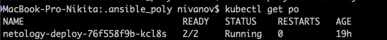
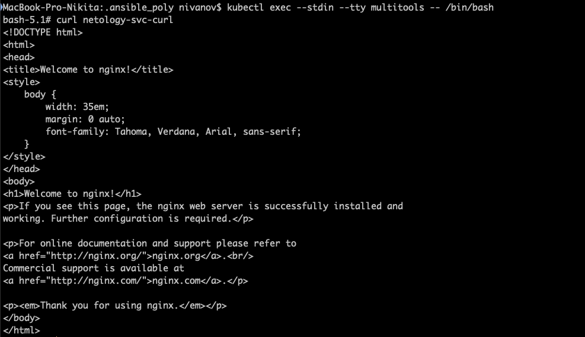
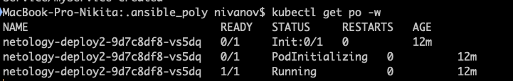

1. Продемонстрировать количество подов до и после масштабирования. 
```yaml
apiVersion: apps/v1
kind: Deployment
metadata:
  name: netology-deploy
  labels:
   app: nginx
spec:
  replicas: 2
  selector:
    matchLabels:
      app: nginx
  template:
   metadata:
    labels:
        app: nginx
   spec:
    containers:
      - name: nginx
        image: nginx:1.14.2
        ports:
        - containerPort: 80
      - name: multitool
        image: wbitt/network-multitool
        ports:
          - containerPort: 8080
        env:
          - name: HTTP_PORT
            value: "8080"
```
```yaml
apiVersion: v1
kind: Pod
metadata:
  labels: {app: multitool}
  name: multitools
spec:
  containers:
  - {image: 'praqma/network-multitool', name: multitools} 
```
```yaml
apiVersion: v1
kind: Service
metadata:
  name: netology-svc-curl
spec:
  ports:
  - name: netology-svc
    port: 80
    protocol: TCP
    targetPort: 80
  selector:
    app: nginx
```


2. из пода есть доступ до приложений из п.1.  
 
3. Продемонстрировать состояние пода до и после запуска сервиса.  
```yaml
apiVersion: apps/v1
kind: Deployment
metadata:
  name: netology-deploy2
  labels:
   app: nginx
spec:
  replicas: 1
  selector:
    matchLabels:
      app: nginx
  template:
   metadata:
    labels:
        app: nginx
   spec:
    containers:
      - name: nginx
        image: nginx:1.14.2
        ports:
        - containerPort: 80
    initContainers:
      - name: init-myservice
        image: busybox:1.28
        command: ['sh', '-c', "until nslookup myservice.$(cat /var/run/secrets/kubernetes.io/serviceaccount/namespace).svc.cluster.local; do echo waiting for myservice; sleep 2; done"]
```
```yaml
apiVersion: v1
kind: Service
metadata:
  name: myservice
spec:
  ports:
  - name: netology-svc2
    port: 80
    protocol: TCP
    targetPort: 80
  selector:
    app: nginx
```
 
 