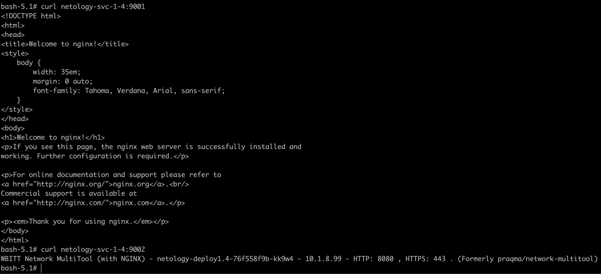
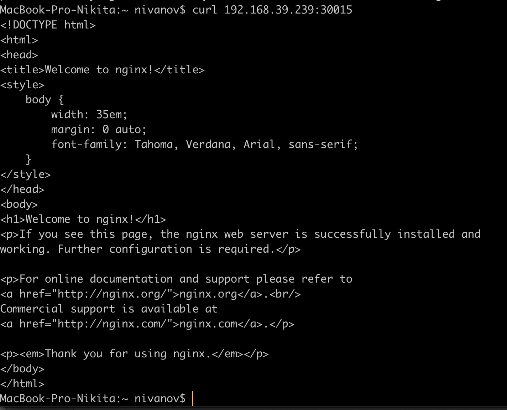

1. Создать Deployment приложения, состоящего из двух контейнеров (nginx и multitool), с количеством реплик 3 шт.
```yaml
apiVersion: apps/v1
kind: Deployment
metadata:
  name: netology-deploy1-4
  labels:
   app: nginx
spec:
  replicas: 3
  selector:
    matchLabels:
      app: nginx
  template:
   metadata:
    labels:
        app: nginx
   spec:
    containers:
      - name: nginx
        image: nginx:1.14.2
        ports:
        - containerPort: 80
      - name: multitool
        image: wbitt/network-multitool
        ports:
          - containerPort: 8080
        env:
          - name: HTTP_PORT
            value: "8080"
```
2. Создать Service, который обеспечит доступ внутри кластера до контейнеров приложения из п.1 по порту 9001 — nginx 80, по 9002 — multitool 8080.

```yaml
apiVersion: v1
kind: Service
metadata:
  name: netology-svc-1-4
spec:
  selector:
    app: nginx
  ports:
  - name: netology-svc-1-4-nginx
    port: 9001
    protocol: TCP
    targetPort: 80
  - name: netology-svc-1-4-multitool
    port: 9002
    protocol: TCP
    targetPort: 8080
```
3. Создать отдельный Pod с приложением multitool и убедиться с помощью curl, что из пода есть доступ до приложения из п.1 по разным портам в разные контейнеры.
```yaml
apiVersion: v1
kind: Pod
metadata:
  labels: {app: multitool}
  name: multitools
spec:
  containers:
  - {image: 'praqma/network-multitool', name: multitools} 
```
4. Продемонстрировать доступ с помощью curl по доменному имени сервиса.


5. Создать отдельный Service приложения из Задания 1 с возможностью доступа снаружи кластера к nginx, используя тип NodePort.
```yaml
apiVersion: v1
kind: Service
metadata:
  name: netology-svc-1-4-2
spec:
  type: NodePort
  selector:
    app: nginx
  ports:
    - port: 80
      targetPort: 80
      nodePort: 30015
```
6. Продемонстрировать доступ с помощью браузера или curl с локального компьютера.

