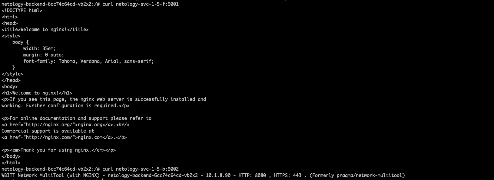
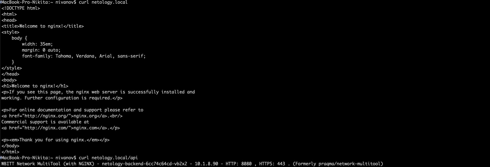

1. Создать Deployment приложения frontend из образа nginx с количеством реплик 3 шт.
```yaml
apiVersion: apps/v1
kind: Deployment
metadata:
  name: netology-frontend
  labels:
   app: frontend
spec:
  replicas: 3
  selector:
    matchLabels:
      app: frontend
  template:
   metadata:
    labels:
        app: frontend
   spec:
    containers:
      - name: nginx
        image: nginx:1.14.2
        ports:
        - containerPort: 80
```
2. Создать Deployment приложения backend из образа multitool.
```yaml
apiVersion: apps/v1
kind: Deployment
metadata:
  name: netology-backend
  labels:
   app: backend
spec:
  replicas: 1
  selector:
    matchLabels:
      app: backend
  template:
   metadata:
    labels:
        app: backend
   spec:
    containers:
      - name: multitool
        image: wbitt/network-multitool
        ports:
          - containerPort: 8080
        env:
          - name: HTTP_PORT
            value: "8080"
```
3. Добавить Service, которые обеспечат доступ к обоим приложениям внутри кластера.
```yaml
apiVersion: v1
kind: Service
metadata:
  name: netology-svc-1-5-f
spec:
  selector:
    app: frontend
  ports:
  - name: netology-svc-1-5-nginx
    port: 9001
    protocol: TCP
    targetPort: 80
```
```yaml
apiVersion: v1
kind: Service
metadata:
  name: netology-svc-1-5-b
spec:
  selector:
    app: backend
  ports:
  - name: netology-svc-1-4-multitool
    port: 9002
    protocol: TCP
    targetPort: 8080
```

1. Создать Ingress, обеспечивающий доступ снаружи по IP-адресу кластера MicroK8S так, чтобы при запросе только по адресу открывался frontend а при добавлении /api - backend.
```yaml
apiVersion: networking.k8s.io/v1
kind: Ingress
metadata: 
  name: netology-ingress
  annotations:
    kubernetes.io/ingress.class: public
    nginx.ingress.kubernetes.io/rewrite-target: /
spec:
  rules:
  - host: netology.local
    http:
      paths:
      - path: / 
        pathType: Prefix
        backend:
          service:
            name: netology-svc-1-5-f
            port: {number: 9001}
      - path: /api
        pathType: Prefix
        backend:
          service:
            name: netology-svc-1-5-b
            port: {number: 9002}
```
2. Продемонстрировать доступ с помощью браузера или curl с локального компьютера.
