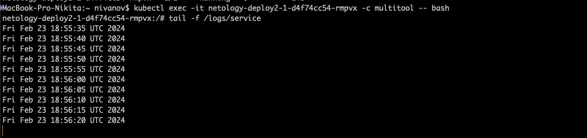
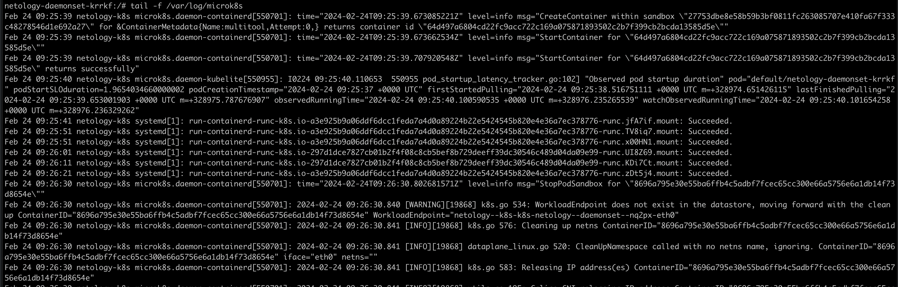

1. Создать Deployment приложения, состоящего из контейнеров busybox и multitool.
Сделать так, чтобы busybox писал каждые пять секунд в некий файл в общей директории.
Обеспечить возможность чтения файла контейнером multitool.
```yaml
apiVersion: apps/v1
kind: Deployment
metadata:
  name: netology-deploy2-1
  labels:
   app: dep_2_1
spec:
  replicas: 1
  selector:
    matchLabels:
      app: dep_2_1
  template:
   metadata:
    labels:
        app: dep_2_1
   spec:
    containers:
      - name: busybox
        image: busybox
        command: ['sh', '-c', "while true; do date >> /logs/service; sleep 5; done"]
        volumeMounts:
          - name: logs
            mountPath: /logs
      - name: multitool
        image: wbitt/network-multitool
        ports:
          - containerPort: 8080
        env:
          - name: HTTP_PORT
            value: "8080"
        volumeMounts:
          - name: logs
            mountPath: /logs
    volumes:
     - name: logs
       emptyDir: {}
```
2. Продемонстрировать, что multitool может читать файл, который периодоически обновляется.

3. Создать DaemonSet приложения, состоящего из multitool.
Обеспечить возможность чтения файла /var/log/syslog кластера MicroK8S.
```yaml
apiVersion: apps/v1
kind: DaemonSet
metadata:
  name: netology-daemonset
spec:
  selector:
    matchLabels:
      name: netology-daemonset
  template:
    metadata:
      labels:
        name: netology-daemonset
    spec:
      containers:
      - name: multitool
        image: wbitt/network-multitool
        ports:
          - containerPort: 8080
        env:
          - name: HTTP_PORT
            value: "8080"
        volumeMounts:
        - name: syslog
          mountPath: /var/log/microk8s
      volumes:
      - name: syslog
        hostPath:
         path: /var/log/syslog 
         type: File
```
