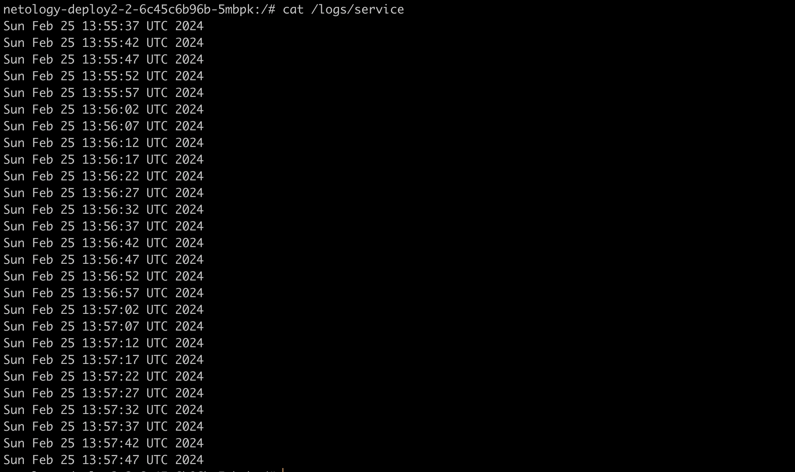
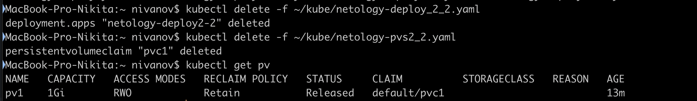
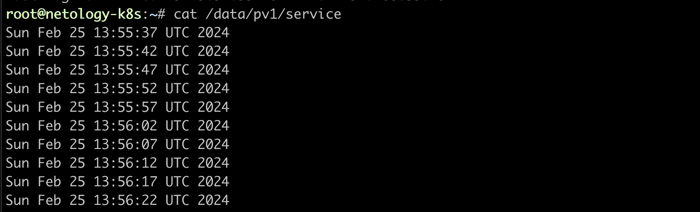
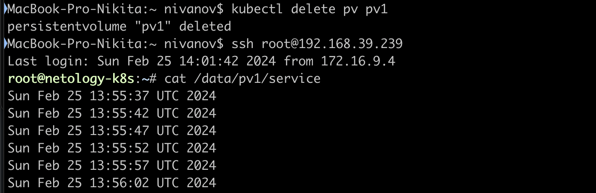
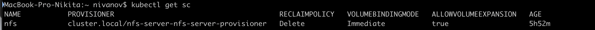

1. Создать Deployment приложения, состоящего из контейнеров busybox и multitool.
Создать PV и PVC для подключения папки на локальной ноде, которая будет использована в поде.
```yaml
apiVersion: apps/v1
kind: Deployment
metadata:
  name: netology-deploy2-2
  labels:
   app: dep_2_2
spec:
  replicas: 1
  selector:
    matchLabels:
      app: dep_2_2
  template:
   metadata:
    labels:
        app: dep_2_2
   spec:
    containers:
      - name: busybox
        image: busybox
        command: ['sh', '-c', "while true; do date >> /logs/service; sleep 5; done"]
        volumeMounts:
          - name: logs
            mountPath: /logs
      - name: multitool
        image: wbitt/network-multitool
        ports:
          - containerPort: 8080
        env:
          - name: HTTP_PORT
            value: "8080"
        volumeMounts:
          - name: logs
            mountPath: /logs
    volumes:
     - name: logs
       persistentVolumeClaim:
           claimName: pvc1
```
```yaml
apiVersion: v1
kind: PersistentVolume
metadata:
 name: pv1
spec:
 capacity:
  storage: 1Gi
 accessModes:
   - ReadWriteOnce
 hostPath:
    path: /data/pv1
 persistentVolumeReclaimPolicy: Retain
```
```yaml
apiVersion: v1
kind: PersistentVolumeClaim
metadata:
 name: pvc1
spec:
 volumeMode: Filesystem
 accessModes:
  - ReadWriteOnce
 resources:
  requests:
   storage: 1Gi
```

2. Удалить Deployment и PVC. Продемонстрировать, что после этого произошло с PV. Пояснить, почему.  

pv оталось так как политика хранениея retain   
3. Продемонстрировать, что файл сохранился на локальном диске ноды.   

4. Удалить PV. Продемонстрировать что произошло с файлом после удаления PV. Пояснить, почему.

остался после удаления так как политика  ```persistentVolumeReclaimPolicy: Retain```  
5. Включить и настроить NFS-сервер на MicroK8S.
  
6. Создать Deployment приложения состоящего из multitool, и подключить к нему PV, созданный автоматически на сервере NFS.  
```yaml
apiVersion: apps/v1
kind: Deployment
metadata:
  name: netology-deploy2-2-2
  labels:
   app: dep_2_2_2
spec:
  replicas: 1
  selector:
    matchLabels:
      app: dep_2_2_2
  template:
   metadata:
    labels:
        app: dep_2_2_2
   spec:
    containers:
      - name: multitool
        image: wbitt/network-multitool
        ports:
          - containerPort: 8080
        env:
          - name: HTTP_PORT
            value: "8080"
        volumeMounts:
          - name: logs
            mountPath: /logs
    volumes:
     - name: logs
       persistentVolumeClaim:
           claimName: pvc-nfs
```
```yaml
apiVersion: v1
kind: PersistentVolumeClaim
metadata:
 name: pvc-nfs
spec:
 storageClassName: nfs
 accessModes:
  - ReadWriteOnce
 resources:
  requests:
   storage: 100Mi
   ```
7. Продемонстрировать возможность чтения и записи файла изнутри пода.  
  