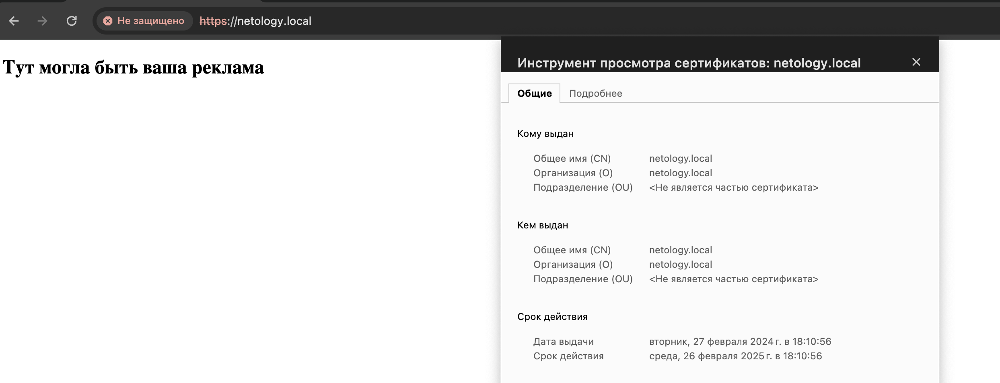

1. Создать Deployment приложения, состоящего из контейнеров nginx и multitool.
Решить возникшую проблему с помощью ConfigMap.
```yaml
apiVersion: apps/v1
kind: Deployment
metadata:
  labels:
    app: nginx
  name: netology-deploy2-3
spec:
  replicas: 1
  selector:
    matchLabels:
      app: nginx
  template:
    metadata:
      labels:
        app: nginx
    spec:
      containers:
      - image: nginx:1.14.2
        name: nginx
        ports:
        - containerPort: 8080
        volumeMounts:
        - mountPath: /etc/nginx/nginx.conf
          name: nginx-config
          subPath: nginx.conf
        - mountPath: /usr/share/nginx/html/index.html
          name: index-file
          subPath: index.html
      - image: wbitt/network-multitool
        name: multitool
        ports:
        - containerPort: 80
      volumes:
      - configMap:
          name: nginx-conf
        name: nginx-config
      - configMap:
          name: nginx-conf
        name: index-file

```
```yaml
apiVersion: v1
data:
  index.html: |
    <!DOCTYPE html>
     <html lang="ru">
      <head>
       <meta charset="utf-8">
       <meta name="viewport" content="width=device-width, initial-scale=1.0">
      </head>
      <body>
       <main>
        <article>
         <section>
          <h2>Тут могла быть ваша реклама</h2>
         </section>
        </article>
       </main>
       <footer>
       </footer>
      </body>
     </html>
  nginx.conf: |
    user  nginx;
    worker_processes  auto;
    error_log  /var/log/nginx/error.log notice;
    pid        /var/run/nginx.pid;
    events {
        worker_connections  1024;
    }

    http {
        include       /etc/nginx/mime.types;
        default_type  application/octet-stream;

        log_format  main  '$remote_addr - $remote_user [$time_local] "$request" '
                          '$status $body_bytes_sent "$http_referer" '
                          '"$http_user_agent" "$http_x_forwarded_for"';

        access_log  /var/log/nginx/access.log  main;

        sendfile        on;
        keepalive_timeout  65;
        server {

          listen       8080;
          server_name  _;


          location / {
            root   /usr/share/nginx/html;
            index  index.html index.htm;
          }
          
          error_page   500 502 503 504  /50x.html;
          location = /50x.html {
              root   /usr/share/nginx/html;
          }
      }

    }
kind: ConfigMap
metadata:
  name: nginx-conf

```
2. Продемонстрировать, что pod стартовал и оба конейнера работают.

3. Сделать простую веб-страницу и подключить её к Nginx с помощью ConfigMap. Подключить Service и показать вывод curl или в браузере.  
```yaml
apiVersion: v1
kind: Service
metadata:
  name: netology-svc-2-3
spec:
  ports:
  - name: netology-svc
    port: 80
    targetPort: 8080
  selector:
    app: nginx
```
  
4. Создать Deployment приложения, состоящего из Nginx.  
```yaml
apiVersion: apps/v1
kind: Deployment
metadata:
  labels:
    app: nginx
  name: netology-deploy2-3-2
spec:
  replicas: 1
  selector:
    matchLabels:
      app: nginx
  template:
    metadata:
      labels:
        app: nginx
    spec:
      containers:
      - image: nginx:1.14.2
        name: nginx
        ports:
        - containerPort: 80
        volumeMounts:
        - mountPath: /usr/share/nginx/html/index.html
          name: index-file
          subPath: index.html
      volumes:
      - configMap:
          name: index-conf
        name: index-file

```
```yaml
apiVersion: v1
kind: Service
metadata:
  name: netology-svc-2-3-2
spec:
  ports:
  - name: netology-svc
    port: 80
    targetPort: 80
  selector:
    app: nginx
```
```yaml
apiVersion: v1
data:
  index.html: |
    <!DOCTYPE html>
     <html lang="ru">
      <head>
       <meta charset="utf-8">
       <meta name="viewport" content="width=device-width, initial-scale=1.0">
      </head>
      <body>
       <main>
        <article>
         <section>
          <h2>Тут могла быть ваша реклама</h2>
         </section>
        </article>
       </main>
       <footer>
       </footer>
      </body>
     </html>
kind: ConfigMap
metadata:
  name: index-conf
```
```yaml
apiVersion: networking.k8s.io/v1
kind: Ingress
metadata:
  name: ing2-3-2
  annotations:
    kubernetes.io/ingress.class: public
    nginx.ingress.kubernetes.io/rewrite-target: /
spec:
  rules:
  - host: netology.local
    http:
     paths:
     - path: /
       pathType: Prefix
       backend:
        service:
          name: netology-svc-2-3-1
          port:
           number: 80
  tls:
   - hosts:
     - netology.local
     secretName: tls-sec
```

  
5. Создать собственную веб-страницу и подключить её как ConfigMap к приложению.
Выпустить самоподписной сертификат SSL. Создать Secret для использования сертификата.
Создать Ingress и необходимый Service, подключить к нему SSL в вид. Продемонстировать доступ к приложению по HTTPS.
  